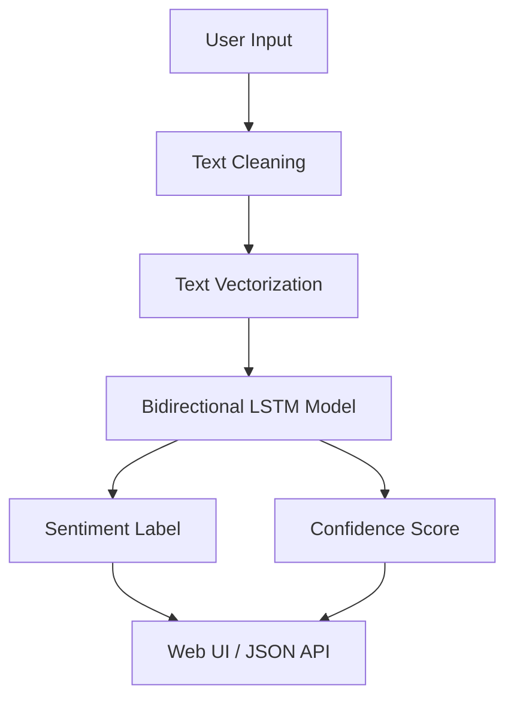

<div align="center">

# Sentiment Analysis Studio

### Deep Learning Sentiment Classifier for Short Text

A Flask-based sentiment analysis app powered by a bidirectional LSTM model that classifies text as Positive or Negative and returns confidence scores through a web interface and REST API.

[](https://sentiment-studio.onrender.com)
[](https://github.com/daivagnaa/Sentiment-Studio)
[](https://python.org)
[](https://flask.palletsprojects.com/)
[](https://www.tensorflow.org/)
[](https://keras.io/)

---

**Analyze short text instantly. Get a sentiment label, confidence score, and cleaned input in one response.**

[Live Demo](https://sentiment-studio.onrender.com) · [Report Bug](https://github.com/daivagnaa/Sentiment-Studio/issues) · [Request Feature](https://github.com/daivagnaa/Sentiment-Studio/issues)

</div>

---

## The Problem

Manually reviewing short user text, feedback, or social posts is slow and inconsistent. Keyword matching alone does not capture tone, context, or emotional meaning.

## The Solution

This project uses a trained deep learning model with text vectorization and emoji-aware preprocessing to classify input as Positive or Negative. The app supports both a browser-based interface and a JSON API for easy integration.

---

## Features

| Feature | Description |
|---------|-------------|
| Binary Sentiment Classification | Predicts Positive or Negative sentiment from raw text |
| Confidence Score | Returns a percentage score for the predicted label |
| Cleaned Text Output | Shows the normalized input after preprocessing |
| Web Form Interface | Simple browser UI for quick manual testing |
| REST API | JSON endpoint for programmatic sentiment checks |
| Health Endpoint | Lightweight /health route for deployment checks |
| Emoji Handling | Common emoticons are mapped to semantic words before inference |
| Lazy Model Loading | Model artifacts load on first request for faster startup |
| Production Ready | Compatible with Gunicorn-style deployment on Render and similar platforms |

---

## Architecture



---

## Tech Stack

<table>
  <tr>
    <td align="center"><b>Category</b></td>
    <td align="center"><b>Technology</b></td>
  </tr>
  <tr>
    <td>Backend</td>
    <td>Python, Flask</td>
  </tr>
  <tr>
    <td>Deep Learning</td>
    <td>TensorFlow, Keras</td>
  </tr>
  <tr>
    <td>Model Type</td>
    <td>Bidirectional LSTM</td>
  </tr>
  <tr>
    <td>Preprocessing</td>
    <td>Regex cleaning, emoji normalization, text vectorization</td>
  </tr>
  <tr>
    <td>Deployment</td>
    <td>Render, Gunicorn-compatible WSGI</td>
  </tr>
  <tr>
    <td>Frontend</td>
    <td>HTML, CSS, JavaScript</td>
  </tr>
</table>

---

## Project Structure

```
Sentiment Analysis/
│
├── app.py                  # Flask application, inference, and API routes
├── inspect_vectorizer.py   # Utility to inspect the saved text vectorizer
├── test_inference.py       # Smoke test for model predictions
├── README.md               # Project documentation
├── requirements.txt        # Python dependencies
├── runtime.txt             # Python runtime version for deployment
├── render.yaml             # Render deployment configuration
│
├── Data/
│   └── training.1600000.processed.noemoticon.csv
│
├── Models/
│   ├── sentiment_model.keras
│   ├── text_vectorizer.keras
│   └── text_vectorizer/
│       ├── saved_model.pb
│       ├── keras_metadata.pb
│       ├── assets/
│       └── variables/
│
├── templates/
│   ├── base.html
│   └── index.html
│
└── static/
    └── css/
        └── style.css
```

---

## Getting Started

### Prerequisites

- Python 3.12
- TensorFlow-compatible environment
- A virtual environment is recommended

### Installation

1. Clone or open the project folder.

   ```bash
   cd "Sentiment Analysis"
   ```

2. Create and activate a virtual environment.

   ```bash
   python -3.12 -m venv .venv
   .\.venv\Scripts\activate
   ```

3. Install dependencies.

   ```bash
   pip install -r requirements.txt
   ```

4. Run the Flask app.

   ```bash
   python app.py
   ```

5. Open the browser interface.

   Navigate to `http://127.0.0.1:5000`

---

## How It Works

### 1. Input Cleaning
- Common emoticons are replaced with sentiment-aware words
- URLs, mentions, and hashtags are removed
- Extra whitespace is normalized

### 2. Vectorization
- Cleaned text is passed through the saved text vectorizer
- The vectorizer converts text into model-ready token sequences
- The model expects sequences of length 200

### 3. Prediction
- A bidirectional LSTM network processes the vectorized input
- The model outputs a probability score between 0 and 1
- Scores above 0.5 are labeled Positive; lower scores are labeled Negative

### 4. Response Delivery
- The browser UI renders the label, confidence, and cleaned text
- The API returns the same result as JSON

---

## API Endpoints

### POST /api/predict
Accepts JSON input and returns the prediction result.

**Request**
```json
{
  "text": "I absolutely love this product"
}
```

**Response**
```json
{
  "label": "Positive",
  "score": 0.9899,
  "confidence": 98.99,
  "cleaned_text": "I absolutely love this product"
}
```

### POST /predict
Submits text through the web form interface.

### GET /health
Returns deployment health status.

```bash
curl http://127.0.0.1:5000/health
```

---

## Model Details

| Item | Value |
|------|-------|
| Model Type | Bidirectional LSTM |
| Vocabulary Size | 20,000 tokens |
| Sequence Length | 200 tokens |
| Embedding Dimension | 128 |
| Dropout Strategy | Progressive dropout across layers |
| Output | Binary sigmoid classification |
| Training Source | 1.6M tweet sentiment dataset |

---

## Training Notes

- Dataset contains 1.6 million tweets labeled for sentiment analysis
- Sentiment labels are normalized into a binary classification setup
- Text is cleaned before tokenization and model training
- The architecture uses embedding, spatial dropout, bidirectional LSTM, pooling, and dense layers

---

## Usage Examples

### Browser UI
Open the app, enter a sentence, and submit it through the form.

### API Request
```bash
curl -X POST http://127.0.0.1:5000/api/predict ^
  -H "Content-Type: application/json" ^
  -d "{\"text\": \"This app works really well\"}"
```

### Inference Test
```bash
python test_inference.py
```

---

## Deployment

The project is configured for cloud deployment with a Render-friendly Flask setup.

- render.yaml defines the service configuration
- runtime.txt pins the Python runtime
- gunicorn is included for production serving

Recommended production command:

```bash
gunicorn -w 4 -b 0.0.0.0:5000 app:app
```

---

## Roadmap

- [x] Binary sentiment prediction
- [x] Web form interface
- [x] REST API endpoint
- [x] Health check endpoint
- [x] Saved model and vectorizer loading
- [ ] Add batch prediction support
- [ ] Add prediction history
- [ ] Add explanation or feature attribution view
- [ ] Add user authentication
- [ ] Expand to multi-class sentiment labels

---

## Developer

Connect with the project maintainer:

[Email](mailto:devparmar1895@gmail.com) | [LinkedIn](https://in.linkedin.com/in/daivagna-parmar-949315316) | [GitHub](https://github.com/daivagnaa)

---

## License

This project is open source and available for educational and commercial use.

---

<div align="center">

> **Version Notice**
>
> This is the initial release of the sentiment analysis project. Future updates may add prediction history, richer explanations, and expanded sentiment categories.

---

**If you found this project useful, consider giving it a star.**

</div>
